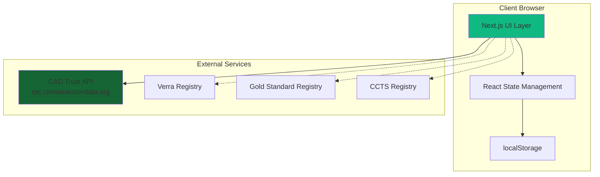

# Design Document: Carbon Trade X MVP

## Overview

Carbon Trade X is a comprehensive web platform for verifying, onboarding, and simulating high-quality carbon credits from major registries. The platform operates as a demo-mode SaaS application with localStorage persistence, integrating live registry data via the CAD Trust Data Model 2.0 API, providing educational content on carbon quality standards, guiding users through registry onboarding processes, implementing an AI-powered MRV multi-agent system, and including a realistic trading simulator.

### Key Features

1. **Credit Verification**: Search and verify carbon credits from Verra, Gold Standard, and CCTS registries using live CAD Trust API data
2. **Educational Content**: Interactive learning modules on carbon credit quality criteria (MRV, additionality, permanence, leakage, co-benefits)
3. **Registry Onboarding**: Step-by-step guidance for Verra and Gold Standard registry onboarding with progress tracking
4. **AI MRV System**: Multi-agent AI system for automated carbon project quality assessment
5. **Trading Simulator**: Realistic marketplace for practicing carbon credit trading with portfolio management

### Technology Stack

- **Framework**: Next.js 15 with App Router
- **Language**: TypeScript
- **Styling**: Tailwind CSS
- **UI Components**: shadcn/ui
- **Icons**: Lucide React
- **Animations**: Framer Motion
- **Charts**: Recharts
- **AI**: Vercel AI SDK
- **Data Persistence**: Browser localStorage
- **External API**: CAD Trust Data Model 2.0 JSON-RPC v2.0

## Architecture

### System Architecture



### Application Architecture

The application follows a layered architecture pattern:

1. **Presentation Layer**: Next.js pages and React components
2. **Business Logic Layer**: Custom hooks, utilities, and service functions
3. **Data Layer**: localStorage abstraction and API clients
4. **External Integration Layer**: CAD Trust API client and mock data fallback

### Directory Structure

```
carbon-trade-x-mvp/
├── app/
│   ├── (auth)/
│   │   ├── dashboard/
│   │   ├── verify/
│   │   ├── learn/
│   │   ├── onboarding/
│   │   ├── ai-mrv/
│   │   ├── simulator/
│   │   └── profile/
│   ├── layout.tsx
│   ├── page.tsx
│   └── globals.css
├── components/
│   ├── ui/              # shadcn/ui components
│   ├── layout/          # Layout components (Sidebar, Navbar, Footer)
│   ├── dashboard/       # Dashboard-specific components
│   ├── verify/          # Verification components
│   ├── learn/           # Educational content components
│   ├── onboarding/      # Onboarding flow components
│   ├── ai-mrv/          # AI MRV system components
│   └── simulator/       # Trading simulator components
├── lib/
│   ├── api/             # API clients
│   ├── storage/         # localStorage utilities
│   ├── types/           # TypeScript type definitions
│   ├── utils/           # Utility functions
│   └── mock-data/       # Mock data for fallback
├── hooks/               # Custom React hooks
├── public/              # Static assets
└── config/              # Configuration files
```

## Components and Interfaces

### Core Components

#### 1. Layout Components

**Sidebar Component**

- Collapsible navigation menu
- Responsive behavior (collapses on mobile)
- Active route highlighting
- Navigation items: Dashboard, Verify Credit, Learn, Onboarding, AI MRV, Simulator, Profile

**Navbar Component**

- Logo display ("Carbon Trade X")
- Demo user avatar
- "Live CAD Trust" status badge
- Responsive design

**Footer Component**

- DPDPA consent banner (first visit only)
- External registry links (Verra, Gold Standard, CAD Trust, CCTS)
- CAD Trust attribution
- Privacy policy link

#### 2. Dashboard Components

**WelcomeCard Component**

- Displays total verified carbon credits (tCO₂e)
- Shows potential portfolio value (₹)
- Calculates metrics from localStorage
- Onboarding prompt when empty

**QuickActionsGrid Component**

- Four action cards linking to main features
- Icons and descriptions for each action
- Hover animations

#### 3. Verification Components

**CreditSearchForm Component**

- Input field for Registry_ID or Project_UID
- Search button with loading state
- Validation for input format

**CreditDetailsCard Component**

- Project name, location, methodology
- Vintage and issuance details
- Quality indicators
- "View Full Registry" external links
- "Live from CAD Trust" or "Demo Data" badge

#### 4. Educational Components

**QualityTabsContainer Component**

- Tab navigation for quality criteria
- Tab panels: MRV Process, Additionality, Permanence, Leakage Prevention, Co-benefits

**QualityCriterionCard Component**

- Expandable/collapsible cards
- Visual diagrams or icons
- Detailed explanations
- Technical term definitions

#### 5. Onboarding Components

**RegistryOnboardingTabs Component**

- Tab navigation for Verra and Gold Standard
- Progress tracking per registry

**OnboardingChecklist Component**

- Checkbox list for required steps
- Progress bar showing completion percentage
- Mock file upload buttons
- Submit button (enabled when complete)
- Success animation on submission

#### 6. AI MRV Components

**MRVChatInterface Component**

- Chat-like message display
- Input field for project description or Registry_ID
- Agent activity indicators
- Streaming message display

**AgentActivityIndicator Component**

- Shows which agent is currently active
- Agent names: Researcher, Verifier, Compliance Checker, Report Generator
- Loading animations

**QualityReportCard Component**

- Overall Quality_Score (0-100) display
- Strengths and weaknesses summary
- Recommendations section
- Downloadable report option

#### 7. Simulator Components

**MarketplaceTable Component**

- Sortable table of available credits
- Columns: Registry_ID, Project Name, Price (₹/tCO₂e), Volume, Quality_Score
- Buy buttons for each credit
- Sorting controls

**PortfolioDisplay Component**

- User's owned credits table
- Columns: Registry_ID, Quantity, Purchase Price, Current Value
- Sell buttons for each credit
- Total portfolio value calculation

**PriceChart Component**

- Line chart using Recharts
- 30-day price history
- Price in ₹/tCO₂e on y-axis
- Dates on x-axis
- Updates when credit selected

**TransactionToast Component**

- Confirmation notifications for buy/sell actions
- Success/error states

#### 8. Profile Components

**KYCForm Component**

- Mock form fields: name, email, organization, country
- "Demo Account — KYC Approved" badge
- Editable API key field
- Save button with localStorage persistence

### Component Interfaces

```typescript
// Core Types
interface CarbonCredit {
  id: string;
  registryId: string;
  registry: "Verra" | "GoldStandard" | "CCTS";
  projectName: string;
  projectUid?: string;
  location: string;
  methodology: string;
  vintage: number;
  issuanceDate: string;
  volume: number; // tCO₂e
  pricePerTonne: number; // ₹
  qualityScore: number; // 0-100
  status: "available" | "owned" | "sold";
}

interface Portfolio {
  credits: PortfolioCredit[];
  totalValue: number;
  totalVolume: number;
}

interface PortfolioCredit extends CarbonCredit {
  quantity: number;
  purchasePrice: number;
  purchaseDate: string;
}

interface CADTrustProject {
  projectId: string;
  projectName: string;
  projectLink: string;
  projectStatus: string;
  projectStatusDate: string;
  registryOfOrigin: string;
  originProjectId: string;
  program: string;
  projectType: string;
  coveredByNDC: string;
  ndcInformation: string;
  projectScale: string;
  projectTags: string;
  estimatedAnnualEmissionReductions: number;
  location: string;
  methodology: string;
  validationBody: string;
  validationDate: string;
}

interface MRVAnalysisResult {
  projectId: string;
  researcherFindings: {
    projectData: CADTrustProject;
    dataSource: "live" | "mock";
  };
  verifierAssessment: {
    additionalityScore: number;
    permanenceScore: number;
    leakageScore: number;
    notes: string;
  };
  complianceCheck: {
    verraCompliant: boolean;
    goldStandardCompliant: boolean;
    issues: string[];
  };
  finalReport: {
    qualityScore: number;
    strengths: string[];
    weaknesses: string[];
    recommendations: string[];
  };
}

interface OnboardingProgress {
  verra: {
    steps: OnboardingStep[];
    completionPercentage: number;
  };
  goldStandard: {
    steps: OnboardingStep[];
    completionPercentage: number;
  };
}

interface OnboardingStep {
  id: string;
  title: string;
  description: string;
  completed: boolean;
  documentRequired: boolean;
}

interface UserProfile {
  name: string;
  email: string;
  organization: string;
  country: string;
  cadTrustApiKey?: string;
  kycStatus: "approved" | "pending" | "not_started";
  consentGiven: boolean;
  consentDate?: string;
}

interface PriceHistoryPoint {
  date: string;
  price: number;
}

// API Response Types
interface CADTrustRPCRequest {
  jsonrpc: "2.0";
  method: string;
  params: any[];
  id: number;
}

interface CADTrustRPCResponse {
  jsonrpc: "2.0";
  result?: any;
  error?: {
    code: number;
    message: string;
  };
  id: number;
}

// Component Props
interface CreditSearchFormProps {
  onSearch: (query: string) => Promise<void>;
  isLoading: boolean;
}

interface CreditDetailsCardProps {
  credit: CarbonCredit;
  project?: CADTrustProject;
  dataSource: "live" | "mock";
}

interface MarketplaceTableProps {
  credits: CarbonCredit[];
  onBuy: (creditId: string) => void;
  sortBy: "price" | "volume" | "qualityScore";
  onSortChange: (sortBy: string) => void;
}

interface PortfolioDisplayProps {
  portfolio: Portfolio;
  onSell: (creditId: string) => void;
}

interface PriceChartProps {
  creditId: string;
  priceHistory: PriceHistoryPoint[];
}

interface MRVChatInterfaceProps {
  onAnalyze: (input: string) => Promise<MRVAnalysisResult>;
  messages: ChatMessage[];
  isAnalyzing: boolean;
  activeAgent?: "researcher" | "verifier" | "compliance" | "report";
}

interface OnboardingChecklistProps {
  registry: "verra" | "goldStandard";
  steps: OnboardingStep[];
  onStepToggle: (stepId: string) => void;
  onSubmit: () => void;
}
```

## Data Models

### localStorage Schema

The application uses localStorage for all data persistence in demo mode. Data is stored as JSON strings under specific keys:

```typescript
// localStorage Keys
const STORAGE_KEYS = {
  PORTFOLIO: "carbon-trade-x:portfolio",
  PROFILE: "carbon-trade-x:profile",
  ONBOARDING_PROGRESS: "carbon-trade-x:onboarding",
  CONSENT: "carbon-trade-x:consent",
  MARKETPLACE: "carbon-trade-x:marketplace",
} as const;

// Storage Utilities
class LocalStorageService {
  static get<T>(key: string, defaultValue: T): T;
  static set<T>(key: string, value: T): void;
  static remove(key: string): void;
  static clear(): void;
  static isAvailable(): boolean;
}
```

### CAD Trust API Integration

**Endpoint**: `https://rpc.climateactiondata.org/v2`

**Protocol**: JSON-RPC 2.0

**Methods Used**:

- `cadt_getProject`: Retrieve project details by Project_UID

**Request Example**:

```json
{
  "jsonrpc": "2.0",
  "method": "cadt_getProject",
  "params": ["PROJECT_UID_HERE"],
  "id": 1
}
```

**Response Example**:

```json
{
  "jsonrpc": "2.0",
  "result": {
    "projectId": "...",
    "projectName": "...",
    "registryOfOrigin": "Verra",
    "originProjectId": "VCS-1234",
    ...
  },
  "id": 1
}
```

**Error Handling**:

- Timeout: 10 seconds
- On failure: Fall back to mock data
- Display appropriate badge: "Live from CAD Trust" vs "Demo Data"

### Mock Data Structure

Mock data is provided for 8 sample carbon credits covering:

- 3 Verra VCUs (forestry, renewable energy, cookstoves)
- 3 Gold Standard VERs (solar, wind, water purification)
- 2 CCTS CCCs (afforestation, energy efficiency)

Each mock credit includes:

- Complete project details matching CAD Trust schema
- 30-day price history with realistic fluctuations
- Quality scores ranging from 65-95
- Varying volumes and prices

## Error Handling

### Error Categories

1. **Network Errors**: CAD Trust API unavailable or timeout
2. **Storage Errors**: localStorage quota exceeded or unavailable
3. **Validation Errors**: Invalid user input
4. **Component Errors**: React component crashes

### Error Handling Strategy

```typescript
// API Error Handling
async function fetchCADTrustProject(projectUid: string): Promise<CADTrustProject> {
  try {
    const response = await fetch('https://rpc.climateactiondata.org/v2', {
      method: 'POST',
      headers: { 'Content-Type': 'application/json' },
      body: JSON.stringify({
        jsonrpc: '2.0',
        method: 'cadt_getProject',
        params: [projectUid],
        id: Date.now(),
      }),
      signal: AbortSignal.timeout(10000), // 10 second timeout
    });

    const data: CADTrustRPCResponse = await response.json();

    if (data.error) {
      console.error('CAD Trust API error:', data.error);
      return getMockProject(projectUid);
    }

    return data.result;
  } catch (error) {
    console.error('Failed to fetch from CAD Trust:', error);
    return getMockProject(projectUid);
  }
}

// Storage Error Handling
function safeLocalStorageSet(key: string, value: any): boolean {
  try {
    localStorage.setItem(key, JSON.stringify(value));
    return true;
  } catch (error) {
    if (error instanceof DOMException && error.name === 'QuotaExceededError') {
      toast.error('Storage quota exceeded. Please clear some data.');
    } else {
      toast.error('Failed to save data. Using memory-only mode.');
    }
    return false;
  }
}

// React Error Boundary
class ErrorBoundary extends React.Component {
  componentDidCatch(error: Error, errorInfo: React.ErrorInfo) {
    console.error('Component error:', error, errorInfo);
    // Display user-friendly error message
  }

  render() {
    if (this.state.hasError) {
      return <ErrorFallback />;
    }
    return this.props.children;
  }
}
```

### Loading States

All async operations display appropriate loading indicators:

- **Skeleton screens**: For initial page loads
- **Spinners**: For button actions and API calls
- **Progress bars**: For multi-step processes (onboarding)
- **Streaming indicators**: For AI MRV agent outputs

### User Feedback

- **Toast notifications**: Transaction confirmations, errors
- **Inline validation**: Form field errors
- **Status badges**: Data source indicators, KYC status
- **Empty states**: Helpful prompts when no data exists

## Testing Strategy

### Property-Based Testing Assessment

**Property-based testing is NOT applicable to this feature** for the following reasons:

1. **UI-Heavy Application**: The majority of functionality involves React component rendering, layout, and user interactions, which are best tested with snapshot tests and visual regression testing
2. **Demo-Mode Configuration**: The application operates primarily as a configuration and state management system using localStorage, not pure functions with universal properties
3. **CRUD and Side Effects**: Most operations are simple CRUD actions (buy/sell credits, save profile) or side-effect operations (API calls, localStorage writes)
4. **External API Integration**: The CAD Trust API integration involves I/O operations and network calls, not pure transformations

**Alternative Testing Strategies**:

- **Snapshot tests** for UI component rendering
- **Example-based unit tests** for utility functions and calculations
- **Integration tests** for localStorage operations and API client behavior
- **End-to-end tests** for critical user flows
- **Manual testing** for accessibility and responsive design

### Testing Approach

Given that this is a demo-mode SaaS application with UI-heavy features, localStorage persistence, and external API integration, the testing strategy focuses on:

1. **Unit Tests**: Component logic, utility functions, data transformations
2. **Integration Tests**: localStorage operations, API client behavior, component interactions
3. **End-to-End Tests**: Critical user flows (verification, trading, onboarding)
4. **Manual Testing**: UI/UX validation, responsive design, accessibility

### Unit Testing

**Test Framework**: Jest + React Testing Library

**Coverage Areas**:

- Utility functions (price calculations, date formatting, validation)
- localStorage service methods
- Mock data generators
- Type guards and validators
- Component rendering with various props

**Example Unit Tests**:

```typescript
describe("Portfolio Calculations", () => {
  test("calculates total portfolio value correctly", () => {
    const portfolio = {
      credits: [
        { quantity: 100, pricePerTonne: 500 },
        { quantity: 50, pricePerTonne: 600 },
      ],
    };
    expect(calculatePortfolioValue(portfolio)).toBe(80000);
  });

  test("handles empty portfolio", () => {
    expect(calculatePortfolioValue({ credits: [] })).toBe(0);
  });
});

describe("LocalStorage Service", () => {
  test("stores and retrieves data correctly", () => {
    const testData = { id: "1", name: "Test" };
    LocalStorageService.set("test-key", testData);
    expect(LocalStorageService.get("test-key", null)).toEqual(testData);
  });

  test("returns default value when key not found", () => {
    expect(LocalStorageService.get("nonexistent", "default")).toBe("default");
  });
});
```

### Integration Testing

**Coverage Areas**:

- CAD Trust API client with mock server
- localStorage persistence across component lifecycle
- Form submission flows
- Trading transactions (buy/sell)
- AI MRV agent orchestration

**Example Integration Tests**:

```typescript
describe('Credit Verification Flow', () => {
  test('searches and displays credit details', async () => {
    render(<VerifyPage />);

    const searchInput = screen.getByPlaceholderText(/enter registry id/i);
    const searchButton = screen.getByRole('button', { name: /search/i });

    await userEvent.type(searchInput, 'VCS-1234');
    await userEvent.click(searchButton);

    await waitFor(() => {
      expect(screen.getByText(/project name/i)).toBeInTheDocument();
    });
  });

  test('falls back to mock data on API failure', async () => {
    server.use(
      rest.post('https://rpc.climateactiondata.org/v2', (req, res, ctx) => {
        return res(ctx.status(500));
      })
    );

    render(<VerifyPage />);
    // ... perform search

    await waitFor(() => {
      expect(screen.getByText(/demo data/i)).toBeInTheDocument();
    });
  });
});

describe('Trading Simulator', () => {
  test('completes buy transaction and updates portfolio', async () => {
    render(<SimulatorPage />);

    const buyButton = screen.getAllByRole('button', { name: /buy/i })[0];
    await userEvent.click(buyButton);

    await waitFor(() => {
      expect(screen.getByText(/purchase successful/i)).toBeInTheDocument();
    });

    // Verify localStorage updated
    const portfolio = LocalStorageService.get(STORAGE_KEYS.PORTFOLIO, null);
    expect(portfolio.credits).toHaveLength(1);
  });
});
```

### End-to-End Testing

**Test Framework**: Playwright or Cypress

**Critical User Flows**:

1. Landing page → Dashboard → Verify credit → View details
2. Dashboard → Simulator → Buy credit → View portfolio → Sell credit
3. Dashboard → Onboarding → Complete checklist → Submit
4. Dashboard → AI MRV → Analyze project → View report
5. First visit → Accept DPDPA consent → Navigate pages

**Example E2E Test**:

```typescript
test("complete trading flow", async ({ page }) => {
  await page.goto("/");
  await page.click("text=Get Started");

  // Navigate to simulator
  await page.click("text=Simulator");

  // Buy a credit
  await page.click('button:has-text("Buy"):first');
  await expect(page.locator("text=Purchase successful")).toBeVisible();

  // Verify portfolio updated
  await expect(page.locator("text=Total Portfolio Value")).toContainText("₹");

  // Sell the credit
  await page.click('button:has-text("Sell"):first');
  await expect(page.locator("text=Sale successful")).toBeVisible();
});
```

### Manual Testing Checklist

- [ ] Responsive design on mobile, tablet, desktop
- [ ] Dark theme consistency across all pages
- [ ] Smooth animations and transitions
- [ ] External links open in new tabs
- [ ] localStorage persistence across browser sessions
- [ ] Graceful degradation when localStorage unavailable
- [ ] CAD Trust API integration with live data
- [ ] Mock data fallback when API unavailable
- [ ] DPDPA consent banner behavior
- [ ] Keyboard navigation and accessibility
- [ ] Screen reader compatibility
- [ ] Form validation and error messages
- [ ] Loading states for all async operations
- [ ] Toast notifications for user actions

### Accessibility Testing

- WCAG 2.1 Level AA compliance target
- Keyboard navigation support
- Screen reader compatibility (ARIA labels)
- Color contrast ratios (dark theme)
- Focus indicators
- Alt text for images and icons

**Note**: Full WCAG validation requires manual testing with assistive technologies and expert accessibility review.

## Deployment

### Build Configuration

**next.config.ts**:

```typescript
import type { NextConfig } from "next";

const nextConfig: NextConfig = {
  reactStrictMode: true,
  images: {
    domains: [],
  },
  env: {
    CAD_TRUST_API_URL: "https://rpc.climateactiondata.org/v2",
  },
};

export default nextConfig;
```

### Environment Variables

No environment variables required for demo mode. All configuration is hardcoded or stored in localStorage.

Optional for production:

- `CAD_TRUST_API_KEY`: API key for authenticated CAD Trust requests
- `NEXT_PUBLIC_APP_URL`: Base URL for the application

### Deployment Steps

1. **Install dependencies**: `npm install`
2. **Build application**: `npm run build`
3. **Test build locally**: `npm start`
4. **Deploy to Vercel**: One-click deployment via Vercel dashboard or CLI

### Vercel Deployment

The application is optimized for Vercel deployment:

- Automatic builds on git push
- Edge network distribution
- Serverless function support (if needed for future backend)
- Environment variable management
- Preview deployments for pull requests

### Performance Optimization

- **Code splitting**: Automatic via Next.js App Router
- **Image optimization**: Next.js Image component
- **Font optimization**: Next.js font optimization
- **Bundle analysis**: `npm run analyze` (with @next/bundle-analyzer)
- **Lazy loading**: Dynamic imports for heavy components
- **Memoization**: React.memo for expensive components

## Security Considerations

### Data Privacy

- **No backend storage**: All data in browser localStorage
- **DPDPA compliance**: Consent banner and privacy policy
- **No PII transmission**: Demo mode operates entirely client-side
- **External links**: Open in new tabs with `rel="noopener noreferrer"`

### API Security

- **HTTPS only**: CAD Trust API uses HTTPS
- **No API key exposure**: API keys stored in localStorage (demo mode)
- **Request timeout**: 10-second timeout prevents hanging requests
- **Error handling**: No sensitive error details exposed to users

### Content Security

- **XSS prevention**: React's built-in escaping
- **Input validation**: All user inputs validated before processing
- **Safe external links**: Verified registry URLs only
- **No eval()**: No dynamic code execution

## Future Enhancements

### Phase 2 Features

1. **Backend Integration**
   - User authentication (OAuth, email/password)
   - PostgreSQL database for persistent storage
   - RESTful API for data operations
   - Real KYC verification integration

2. **Advanced Trading**
   - Real-time price updates via WebSocket
   - Order book and limit orders
   - Transaction history and analytics
   - Portfolio performance tracking

3. **Enhanced AI MRV**
   - Integration with actual AI models (GPT-4, Claude)
   - Document upload and analysis
   - Automated report generation
   - Continuous monitoring and alerts

4. **Additional Registries**
   - American Carbon Registry (ACR)
   - Climate Action Reserve (CAR)
   - International carbon markets

5. **Mobile Application**
   - React Native mobile app
   - Push notifications
   - Offline mode with sync

### Scalability Considerations

- **Database**: PostgreSQL with proper indexing
- **Caching**: Redis for frequently accessed data
- **CDN**: Static asset distribution
- **Load balancing**: Horizontal scaling for API servers
- **Rate limiting**: Protect against abuse
- **Monitoring**: Application performance monitoring (APM)

---

**Document Version**: 1.0  
**Last Updated**: 2025-01-27  
**Status**: Ready for Implementation
